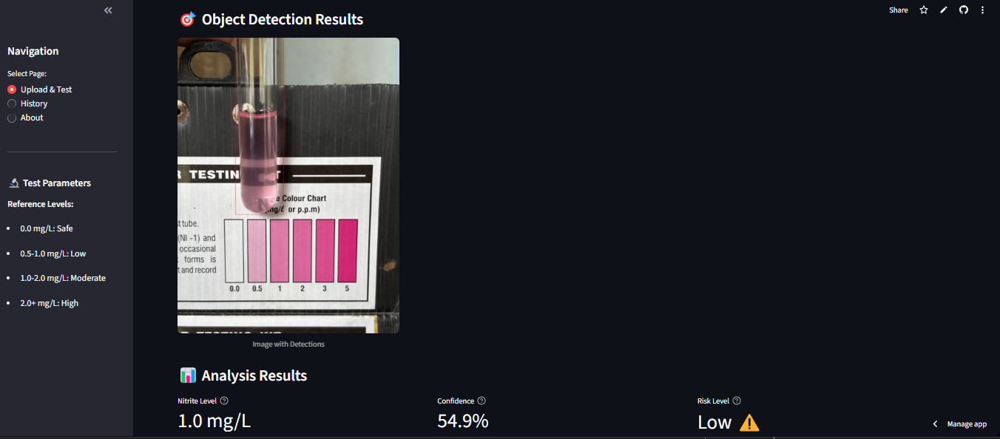

# 🧪 Nitrite Color Identification System

A Streamlit-based web application for automated detection and quantification of nitrite concentration in water samples using computer vision and AI-powered color analysis.

---

## 🚀 Features

- **AI-Powered Analysis:** Uses YOLOv8 for object detection (test strips, tubes, color charts).
- **Color Extraction:** K-means clustering for dominant color detection in test regions.
- **Color Matching:** LAB color space comparison to reference color chart for accurate nitrite estimation.
- **Confidence Scoring:** Each result includes a reliability/confidence score.
- **Multi-format Support:** Accepts JPG, JPEG, PNG, BMP, TIFF images.
- **History Tracking:** Stores all test results and images in a local SQLite database.
- **Interactive Visualization:** Shows detections, color analysis, and recommendations.
- **Unit Selection:** Supports mg/L and ppm units.
- **Downloadable Results:** Download analyzed images and review previous tests.

---

## 🖥️ How It Works

1. **Upload an Image:** Provide a photo of your nitrite test strip or water sample.
2. **Object Detection:** The app locates relevant regions (test tube, strip, color chart) using YOLO.
3. **Color Analysis:** Extracts the dominant color from the detected region.
4. **Color Matching:** Compares the detected color to a reference chart using LAB color space.
5. **Result Output:** Displays estimated nitrite concentration, confidence, and health recommendations.
6. **History:** All results and images are saved for future review.

---

## 📦 Installation

1. **Clone the repository:**
    ```sh
    git clone https://github.com/Dnadithya/nitrate_detection.git
    cd nitrate_detection
    ```

2. **Install dependencies:**
    ```sh
    pip install -r requirements.txt
    ```

3. **Download YOLOv8 weights:**
    - Place your YOLOv8 weights file (e.g., `best.pt`) in the `weights/` directory.
    - If not present, the default YOLOv8n weights will be used.

---

## 🏃‍♂️ Usage

1. **Run the Streamlit app:**
    ```sh
    streamlit run app.py
    ```

2. **Open your browser:**  
   Visit [http://localhost:8501](http://localhost:8501) to access the app.

3. **Upload and Analyze:**
    - Go to "Upload & Test"
    - Upload your image and select options
    - View results, color analysis, and recommendations

4. **Review History:**
    - Go to "History" to see previous tests and download images

---

## 📝 Reference Levels

| Nitrite (mg/L) | Interpretation         | Recommendation                |
|----------------|-----------------------|-------------------------------|
| 0.0            | Safe                  | No action needed              |
| 0.5 - 1.0      | Low                   | Monitor regularly             |
| 1.0 - 2.0      | Moderate              | Take action to reduce levels  |
| >2.0           | High                  | Immediate attention required  |

---
## Expected Result



## 🛠️ Technical Details

- **Framework:** Streamlit
- **AI Model:** YOLOv8 (Ultralytics)
- **Color Analysis:** LAB color space, K-means clustering
- **Database:** SQLite (local file: `nitrite.db`)
- **Image Processing:** OpenCV, PIL, scikit-learn

---
